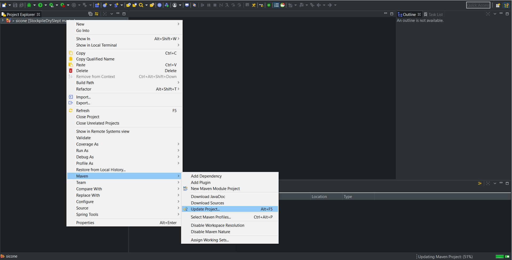
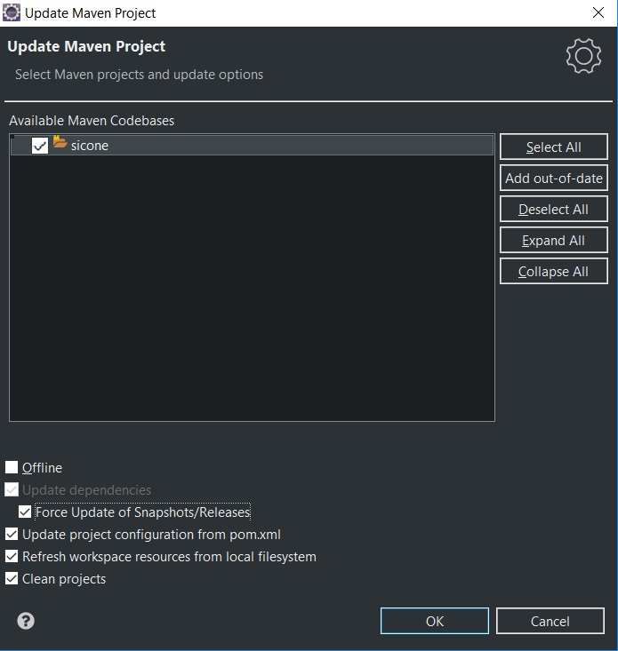

## Sicone: Sistema Integrado de Controle de Estoque 


Desenvolvido por [@botomniac](https://github.com/botomniac), [@dekxside](https://github.com/dekxside) e [@otacalado](https://github.com/otacalado).

Documentação disponível na [**wiki**](https://github.com/dekxside/StockpileDrySlept/wiki).

#### Configuração do ambiente para um projeto existente (Windows)

Clone o projeto e abra-o no **EclipseEE**.

##### Configurando o Spring

````

````

##### Configurando o Hibernate


    
------

#### Configuração do ambiente para um novo projeto (Windows)

##### Criando um projeto Maven

No **EclipseEE**, crie um projeto **Maven**.


Na tela de seleção do archetype, escolha *maven-archetype-webapp*.


Nomeie o **Group Id**, *com.sicone* no nosso caso, e no **Artifact Id** coloque *sicone*. Caso tenha dúvidas quanto ao que colocar nesses campos, veja o [guia de convenção](https://maven.apache.org/guides/mini/guide-naming-conventions.html) do Maven.


##### Solução para o erro relacionado a plugins do Maven e ao Java Build Path.
````
Could not calculate build plan: Plugin org.apache.maven.plugins:maven-resources-plugin:2.6 or one of its dependencies could not be resolved: Failed to read artifact descriptor for org.apache.maven.plugins:maven-resources-plugin:jar:2.6
Plugin org.apache.maven.plugins:maven-resources-plugin:2.6 or one of its dependencies could not be resolved: Failed to read artifact descriptor for org.apache.maven.plugins:maven-resources-plugin:jar:2.6
````

Clique com o botão direito no projeto, vá em ***Maven*** e ***Update project***.



Selecione a opção ***Force update of Snapshots/Releases*** e de Ok.



Caso apareça algum erro relacionado ao `Java Build Path`, abra o arquivo `pom.xml` e adcione a seguinte dependência dentro de `<dependencies>`.
````
<dependency>
  <groupId>javax.servlet</groupId>
  <artifactId>javax.servlet-api</artifactId>
  <version>3.1.0</version>
  <scope>provided</scope>
</dependency>
 ````

##### Adicionando o Spring

##### Adicionando o Hibernate
