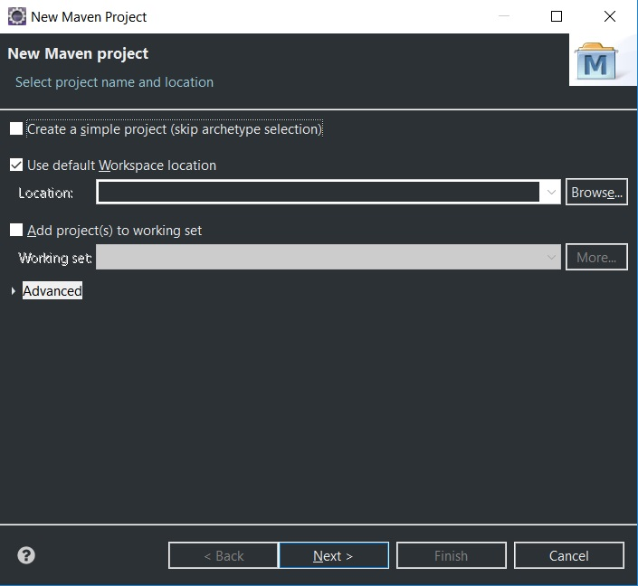
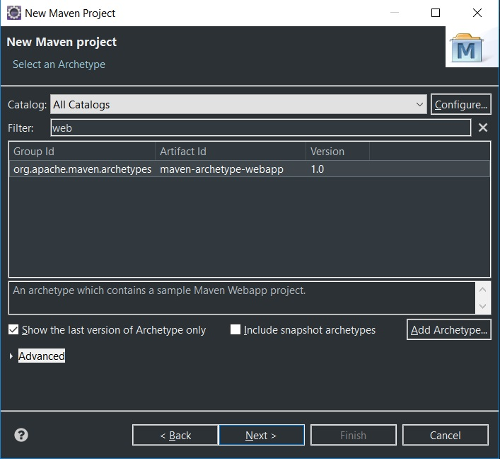
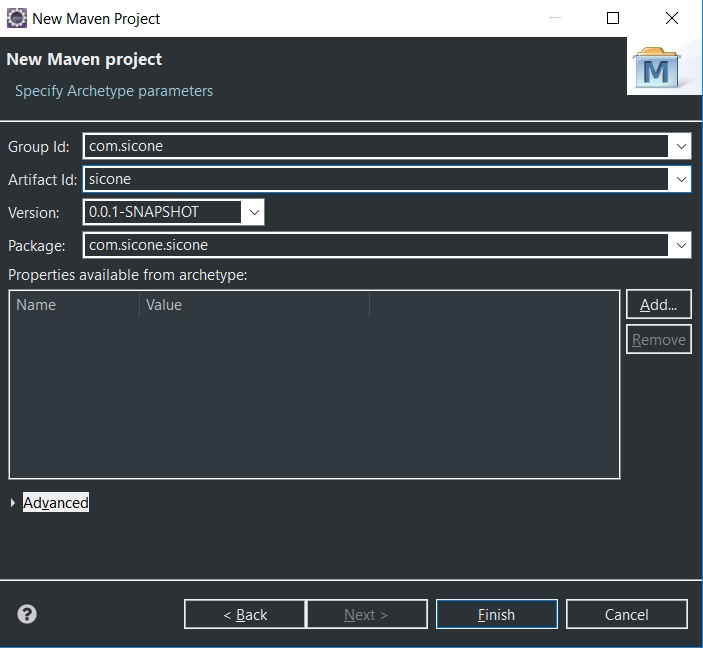

## Sicone: Sistema Integrado de Controle de Estoque 


Desenvolvido por [@botomniac](https://github.com/botomniac), [@dekxside](https://github.com/dekxside) e [@otacalado](https://github.com/otacalado).

Documentação disponível na [**wiki**](https://github.com/dekxside/StockpileDrySlept/wiki).

#### Configuração do ambiente para um projeto existente (Windows)

Clone o projeto e abra-o no **EclipseEE**.

##### Configurando o Spring

````

````

##### Configurando o Hibernate


    
------

#### Configuração do ambiente para um novo projeto (Windows)

No **EclipseEE**, crie um projeto **Maven**.



Na tela de seleção do archetype, escolha *maven-archetype-webapp*.



Nomeie o **Group Id**, *com.sicone* no nosso caso, e no **Artifact Id** coloque *webapp*. Caso tenha dúvidas quanto ao que colocar nesses campos, veja o [guia de convenção](https://maven.apache.org/guides/mini/guide-naming-conventions.html) do Maven.


